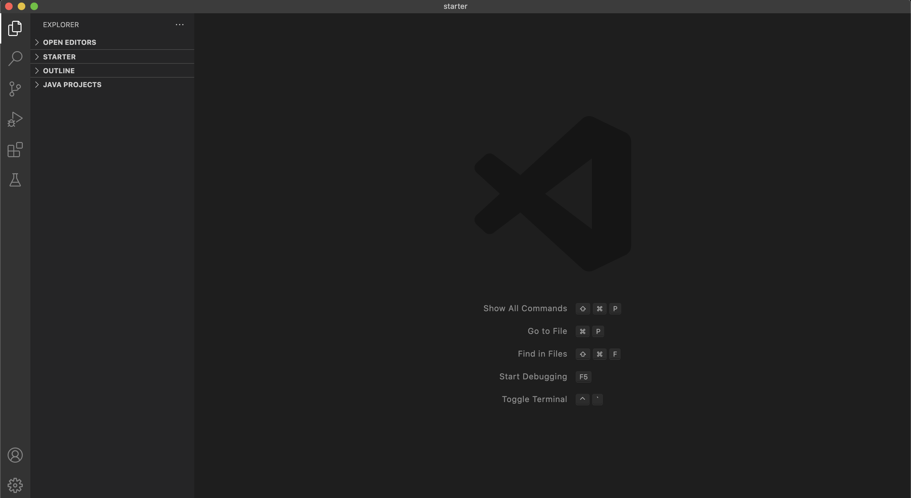
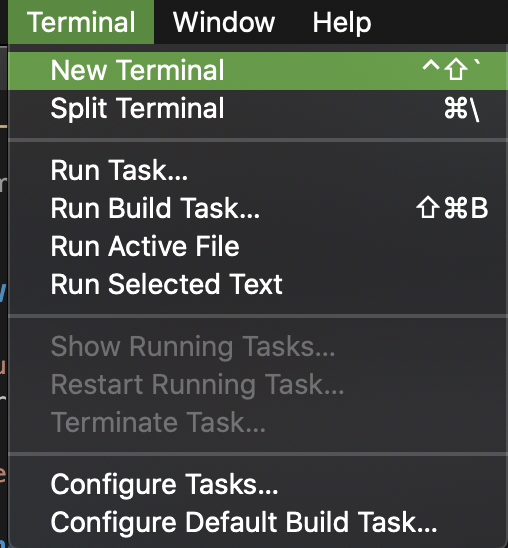
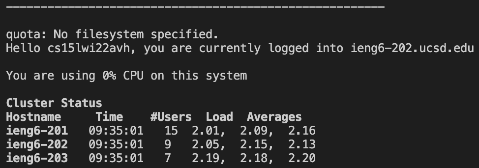
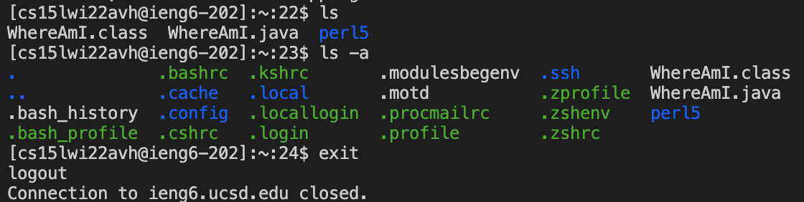
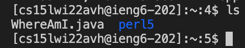
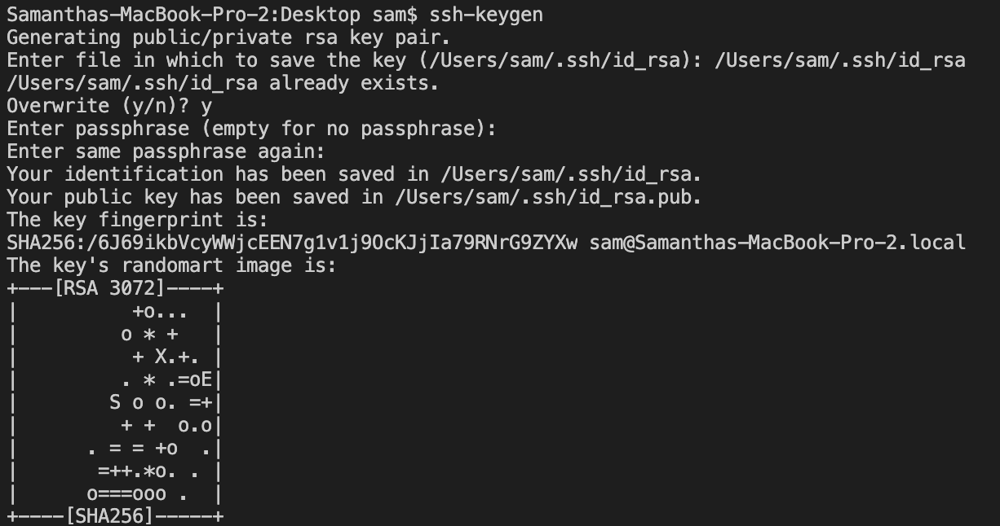
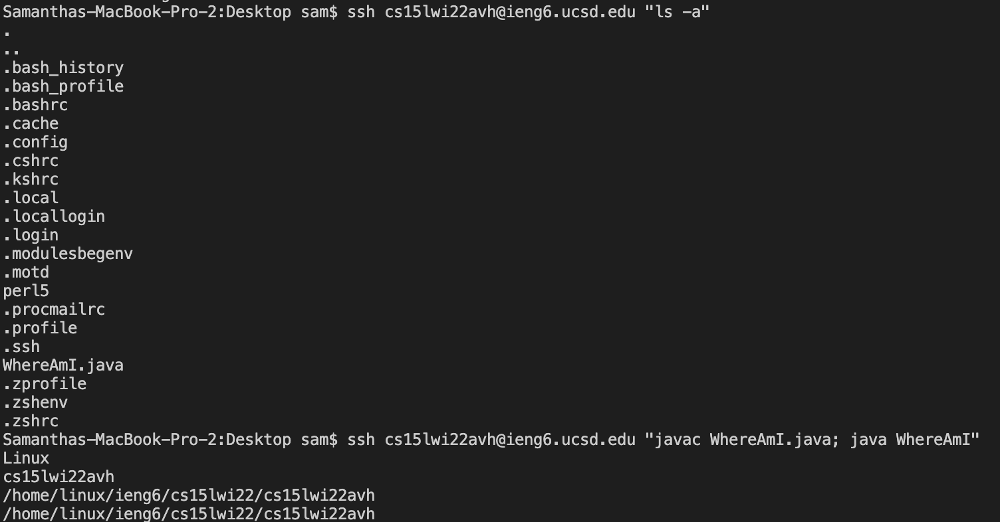

# **Lab Report 1**

## **Installing VS Code**

Go to the [Visual Studio Code website](https://code.visualstudio.com/) where there are instructions for downloading and install VS Code on your computer.
Here's what VS Code looks like once you've installed it.
 

## **Remotely Connecting**

First look up your course account by going to [Account Lookup](https://sdacs.ucsd.edu/~icc/index.php). Next open a terminal in VS Code by clicking on Terminal and then New Terminal in the menu options. 
 
 
In the command line, run `$ ssh (account name here)@ieng6.ucsd.edu`. When prompted in VS Code click Remote-SSh: Connect to Host. Your first time connecting remotely you'll be asked if you want to continue connecting, type `yes` and press enter, then type in your password and enter again. Now you've successfully connected to a remote server!  
 
Under your log in command you should see a message like theone below:

## **Trying Some Commands**

Let's try some commands!
 
`ls` lists the files in the current directory.  
`ls -a` lists all the files in the current directory including hidden files (files with names that start with ".")  
`exit` logs you out of the remote server. 
Here's what these commands looks like: 

## **Moving Files with scp**

What if you want to copy a file from your computer to a remote server? We can use the command `scp` to copy a file you created on your computer to a remote server. Locally, in the directory where you created your file, compile and run your file. Then `ssh` to your remote server and `scp fileName cs15lwi22zz@ieng6.ucsd.edu:~/` to copy your file into the remote server. You'll be asked to input your password again. Using the `ls` command you can see your file listed in the directory on the remote server. 
  Note: If you already have a file with the same name on your server, `scp` will override the original file.

## **Setting an SSH Key**

SSH Keys have both a public and private key that pairs the client (your computer) to the remote server instead of having you input a password. To create the keys run `ssh-keygen`. Then you'll be prompted to enter a file where the key will be saved, so copy paste the location given in parentheses and press the enter key as your passphrase.  

Next we need to copy the public key to the .ssh directory on the remote server. SSH to the remote server and log in. Then on the server, make a directory named .ssh `mkdir .ssh` and log out of the server. On your local computer, `scp /Users/sam/.ssh/id_rsa.pub cs15lwi22zz@ieng6.ucsd.edu:~/.ssh/authorized_keys` (yours will have your name instead of sam). Type in your server login password when prompted.  

Now when you log onto a remote server you won't be prompted for a password!
  

## **Optimizing Remote Running**

There are several simple ways to optimize remote running. In fact you just learned how to optimize your server log in with ssh keys! Other neat tricks are using the up arrow key to bring back the last command and running mulitple commands in one line. For example, you can compile and run a file in the same line if you separate the commands with a semicolon `javac WhereAmI.java; java WhereAmI`. You can also run commands while logging into a server by running additional commands in quotes, `ssh cs15lwi22zz@ieng6.ucsd.edu "javac WhereAmI.java; java WhereAmI"`. 
