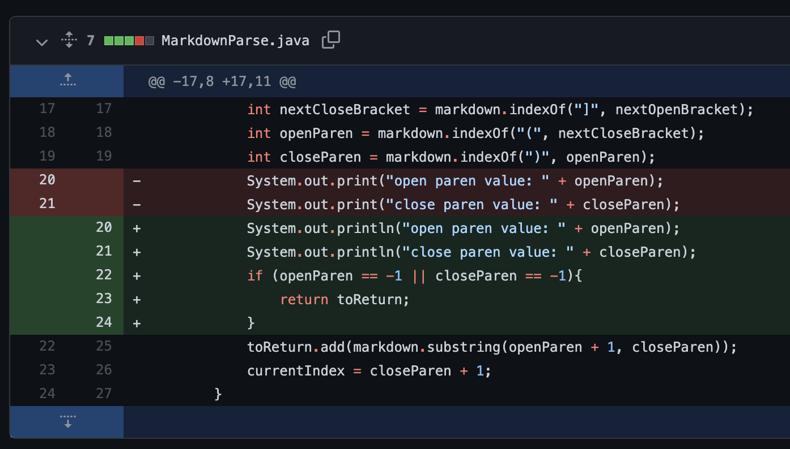
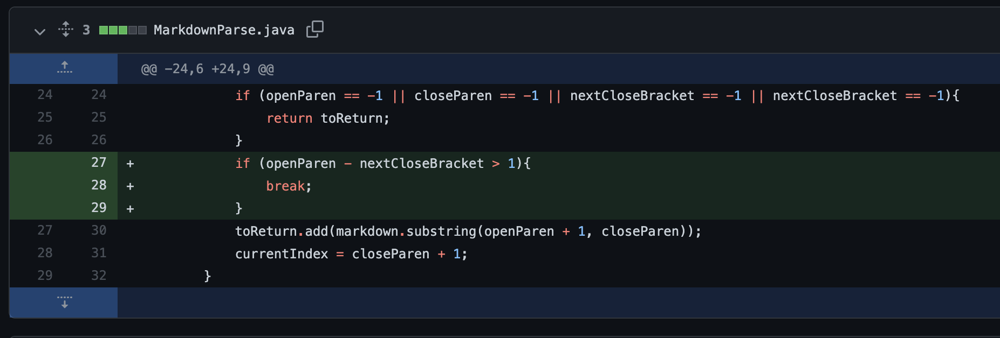
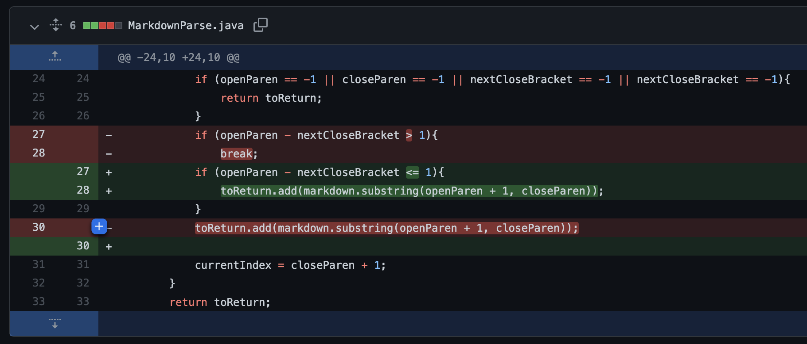

# **Lab Report 2**

## **Code Change 1**
<br>



[Failure-inducing input](https://github.com/sammg13/markdown-parse/blob/22e2749d2d40ee30fe9171f8a74c7544bffbd8ee/new-test-file.md)

Symptom:<br>
```
Exception in thread "main" java.lang.StringIndexOutOfBoundsException: begin 0, end -1, length 7 
        at java.base/java.lang.String.checkBoundsBeginEnd(String.java:3734)
        at java.base/java.lang.String.substring(String.java:1903)
        at MarkdownParse.getLinks(MarkdownParse.java:22)
        at MarkdownParse.main(MarkdownParse.java:30)
```

The failure-inducing input was causes the symptom where MarkdownParse.java throws an `IndexOutOfBoundsException` because it was searching for the index of "(" in a file where it didn't exist. The bug is that nowhere in MarkdownParse.java checked if there was a set of parentheses following square brackets. The code was trying to create a substring of a link with an invalid index for "(" since it wasn't contianed in the file being read.
<br>
 
## **Code Change 2**
<br>

 

[Failure-inducing input](https://github.com/sammg13/markdown-parse/blob/22e2749d2d40ee30fe9171f8a74c7544bffbd8ee/another-test-file.md)

Symptom:<br>
```
markdown length: 8
current index: 0
open paren value: 0
close paren value: 7
[things]
```

Here the failure-inducing input, another-test-file.md, causes the symptom where `[things]` prints even though it's not a link. The bug is that the input is read as a link simply because there is text inside square brackets. This is wrong because we need a set of parentheses with a webpage address immediately after the brackets in order for the link to work.

## **Code Change 3**
<br>



[Failure-inducing input](https://github.com/sammg13/markdown-parse/blob/22e2749d2d40ee30fe9171f8a74c7544bffbd8ee/test4-file.md)

Symptom:<br>
```
markdown length: 52
current index: 0
open paren value: 31
close paren value: 51
next open bracket value 9
next open bracket value 17
[https:something.com]
```

The failure-inducing input was test4-file.md, since there are extra characters and spaces between the square brackets and parentheses we don't want MarkdownParse.java to produce a link. The symptom above shows `[https:something.com]`, this should've been an empty ArrayList because of the extra characters between the parentheses and square brackets. Since MarkdownParse.java was missing a check that the parentheses immediately followed the square brackets, it created a bug which allowed the symptom to display.