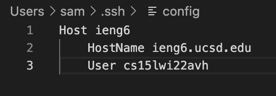
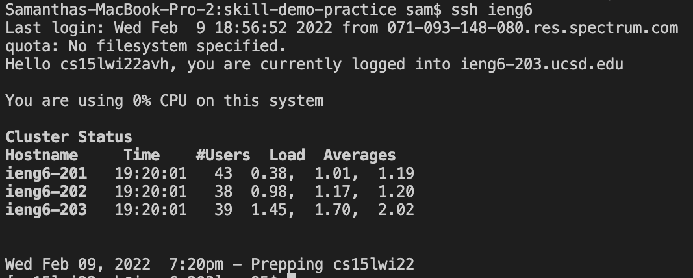
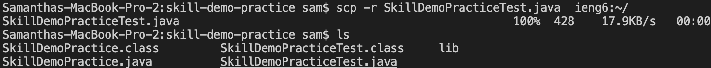

# **Lab Report 3**

## **Streamlining ssh Configuration**

 
In terminal on VS Code, I used the comand `code ~/.ssh/config` to create a .ssh file and input the code in the image above. I gave the host the alias ieng6 since that's part of the server name. 

 
I tested my ssh login using the alias ieng6 instead of typing my full uername. This made my login keystrokes decrease from 33 keystrokes to just 10! Now I can use the alias in the command line to save time.

 
Here is an example of using the alias to copy a file to the server.
