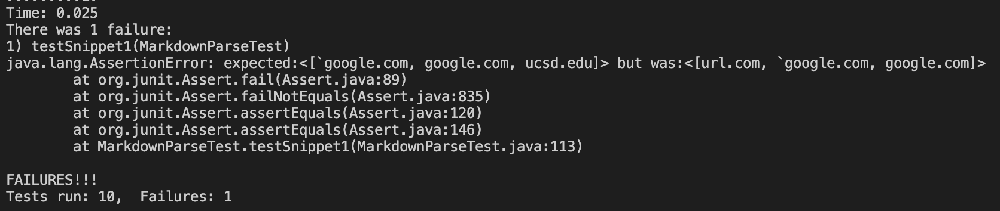

## Repository Links 
[My MarkdownParse repo](https://github.com/sammg13/CSE15L-Platypus.git)  
[Another group's MarkdownParse repo](https://github.com/ezhou413/markdown-parse.git)
 

# Snippet 1

This is the test I ran using snippet 1 for both of the `MarkdownParse` files.  

## My implementation:

Here is the failing result of my implementation after running the test with snippet 1.  

  

## Other group's implementation:

The other group's implementation also failed when tested on snippet 1.  

  

## Code change suggestion

To correct my code, I could add another if condition where I check if there are a set backticks before, after, or interrupting a set of brackets or the opening parenthesis. If that's the case, then a link shouldn't be produced and `url.com` from snippet 1 shouldn't be added to the list of links.
 

# Snippet 2

This is the test I ran using snippet 2 for both of the `MarkdownParse` files.  

  

## My implementation:

Here is the failing result of my implementation after running the test with snippet 2.  

  

## Other group's implementation:

The other group's implementation also failed when tested on snippet 2.  

  

## Code change suggestion

For cases similar to snippet 2, I could add an if condition that recursively calls `getLinks` if there is a set of brackets within a set of brackets. Then `getlinks` should start again at the internal open bracket. If there's a valid link within the original set of brackets, `getLinks` should move on to the next open bracket instead of continuing the link search on the original set of outter brackets.
 

# Snippet 3

This is the test I ran using snippet 3 for both of the `MarkdownParse` files.  

  

## My implementation:

Here is the failing result of my implementation after running the test with snippet 3.  

  

## Other group's implementation:

The other group's implementation also failed when tested on snippet 2.  

  

## Code change suggestion

I think it would be difficult to make a 10 line or less change to `MarkdownParse` in order to work for snippet 3 and all related cases. This is because you have to take into account the cases with several newlines including the snippet 2 case. It would be difficult determining whether a closing parenthesis was forgotten, or if there's a nested link when there are new open brackets or parentheses before the next close parenthesis.