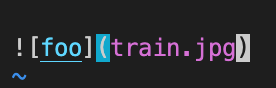
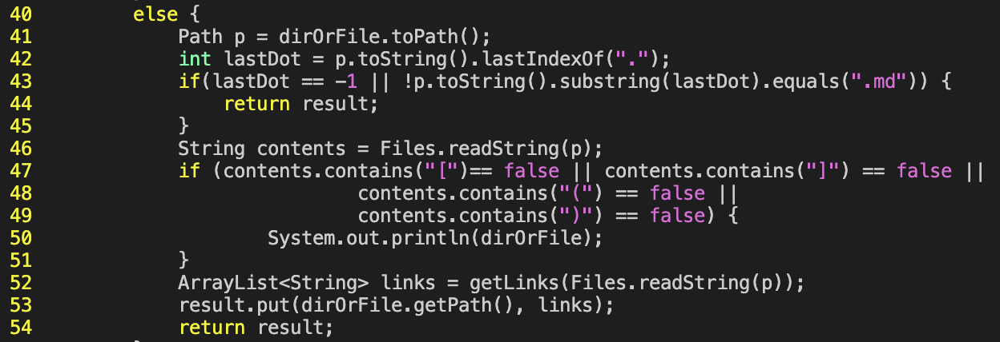
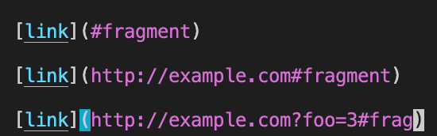
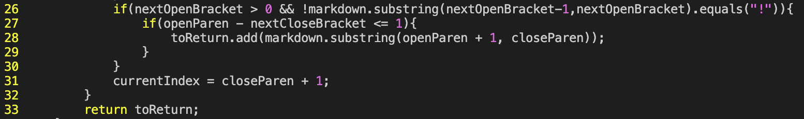

## Finding tests with different results

To find tests with different results I ran `diff CSE15L-Platypus/results.txt markdown-parse/results.txt`. The `diff` command compares `results.txt` from the `CSE15L-Platypus/` repository to `results.txt` from `markdown-parse/`.

## Test 1: 577.md

  

Above is the test file that produces different outputs in the `MarkdownParse` files. The expected output is `[]` because this file contains an image reference due to the `!`, so no links should be added to the array. In the course implementation of `MarkdownParse`, the output is `[train.png]`. This is incorrect since the expected output is an empty array. In my implementation of `MarkdownParse`, the output is `[]` which is correct since the output matches the expected output.

  

Above are lines 40 through 54 of the course implementation of `MarkdownParse`. This block of code, is missing a check if the file contains an `!` before the opening bracket.

## Test 2: 500.md

  

Above is another test file that produces different outputs in the `MarkdownParse` files. The expected output is `[#fragment, http://example.com#fragment, http://example.com?foo=3#frag]`. In the course implementation of `MarkdownParse`, the output is `[#fragment, http://example.com#fragment, http://example.com?foo=3#frag]` which matches the expected output. In my implementation of `MarkdownParse`, the output is `[http://example.com#fragment, http://example.com?foo=3#frag]` which is incorrect since it's missing the address of the first link.

  

Above are lines 26 through 33 of my implementation of `MarkdownParse`. Since the first link in test file starts at index 0, line 26 returns false because `nextOpenBracket` is 0 and `0 > 0` is false. Therefore, we don't add the link address to the array and instead we update `currentIndex` and move on to find the next open bracket. 